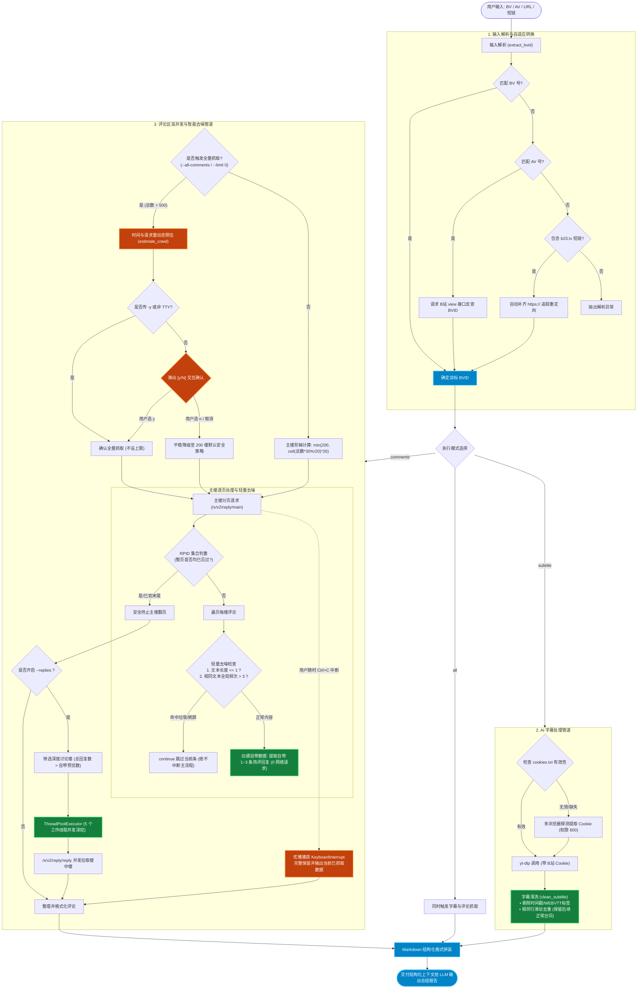

# bili-review 📺

> 获取视频AI字幕总结+读取【评论区楼中楼】（痛点）并总结。
>
> 如果这个项目对你有用，欢迎 [⭐ Star](https://github.com/frozentearz/bili-review) 支持，遇到问题或建议请 [📝 提 Issue](https://github.com/frozentearz/bili-review/issues)。

## 特性

- **AI 字幕总结**：yt-dlp 抓取 B 站 AI 字幕，LLM 分段总结视频内容
- **评论区总结**：爬取热门评论 + 楼中楼，LLM 做观点聚类与情绪分析
- **登录态自动复用**：首次从浏览器提取 cookie 存本地，有效期约 150 天，期间全自动
- **免费零依赖**：无第三方 API Key，仅需 `yt-dlp` + Python 标准库
- **跨平台**：macOS / Windows / Linux

## 安装

### 方式一：ClawHub

```bash
openclaw skills install @frozentearz/bili-review
```

### 方式二：npx skills（任意 agent）

```bash
npx skills add frozentearz/bili-review -g
```

### 方式三：手动

```bash
git clone https://github.com/frozentearz/bili-review.git
# 将 bili-review 目录放入你的 agent skills 目录
```

依赖：`yt-dlp`（`brew install yt-dlp` 或 `pip install yt-dlp`）

## 快速开始

```bash
# 1. 首次：提取浏览器登录态（弹窗授权一次，之后 150 天自动复用）
python3 scripts/bili_review.py login

# 2. 字幕总结
python3 scripts/bili_review.py subtitle "BV1GJ411x7h7"

# 3. 评论总结（含楼中楼）
python3 scripts/bili_review.py comments "BV1GJ411x7h7" --replies

# 4. 字幕 + 评论一次抓完
python3 scripts/bili_review.py all "BV1GJ411x7h7"
```

支持 BV 号 / 完整链接 / b23.tv 短链。

## 评论爬取规则

**楼层**（按热度排序）：

```
楼层 = min(200, ceil(评论数 × 30% ÷ 20) × 20)
```

单调不降、按 20 条/页对齐、自动封顶 200 楼（10 页请求）。

**楼中楼**：
- 默认自动提取主接口自带的 1~3 条热评回复（0 额外网络请求）。
- `--replies` 开启时，使用 Python 标准库线程池并发深挖：

| 单楼回复数 | 爬取条数 |
|---|---|
| ≤20 | 全爬 |
| 21-250 | 40 条 |
| 250+ | 60 条 |

**全量扫描与时间预估**：
- 支持 `--all-comments` 或 `--limit 0` 进行不设上限的全量爬取。
- 大体量视频（>500 条）触发时，控制台自动进行请求量与时间预估，并弹出 `[y/N]` 交互确认；输入 `n` 自动降级为默认安全上限。
- 非交互环境或脚本可配合 `-y / --yes` 自动确认全量。
- 随时支持 `Ctrl+C` 优雅中断，已爬取数据完整保存输出。

**去噪规则**：过滤单字符/纯符号水评；同一文本出现超过 3 次仅跳过当前条（不中断后续正常评论抓取）。

**防死循环**：基于评论唯一 ID（RPID）集合与游标状态判断，防止接口卡死。

**限流保护**：HTTP 412 自动退避重试（3s/6s，最多 3 次）。

## 登录态机制

- 自动探测多浏览器：chrome → edge → firefox → brave → chromium → opera → vivaldi → whale → safari
- mac 上 Chrome 系首次弹钥匙串授权框，点「始终允许」后永久免弹；Firefox 永不弹窗
- 登录态存 `cookies.txt`，SESSDATA 有效期约 150 天，过期自动重新提取

## 安全说明

- `cookies.txt` **仅包含 B 站相关域名**（`bilibili.com` / `b23.tv` / `biligame.com` 等），绝不导出其他网站 cookie
- 文件权限 `600`（仅当前用户可读）
- 已通过 `.gitignore` / `.clawhubignore` 排除，不会进入仓库或发布包

## 架构与数据管道

> 💡 **在线交互版**：可访问 [🔗 GitHub Pages 高清流程图](https://frozentearz.github.io/bili-review/flowchart.html)（支持鼠标滚轮无级缩放与拖拽）。



## 项目结构

```
bili-review/
├── SKILL.md                    # Skill 文档（ClawHub 规范）
├── flowchart.html              # 架构与数据管道交互图（支持 GitHub Pages 在线预览）
├── scripts/
│   ├── bili_review.py          # 主脚本：字幕 + 评论抓取
│   └── extract_cookies.py      # 浏览器 cookie 提取（仅 B 站域名）
```

## License

MIT-0（ClawHub 发布规范）
