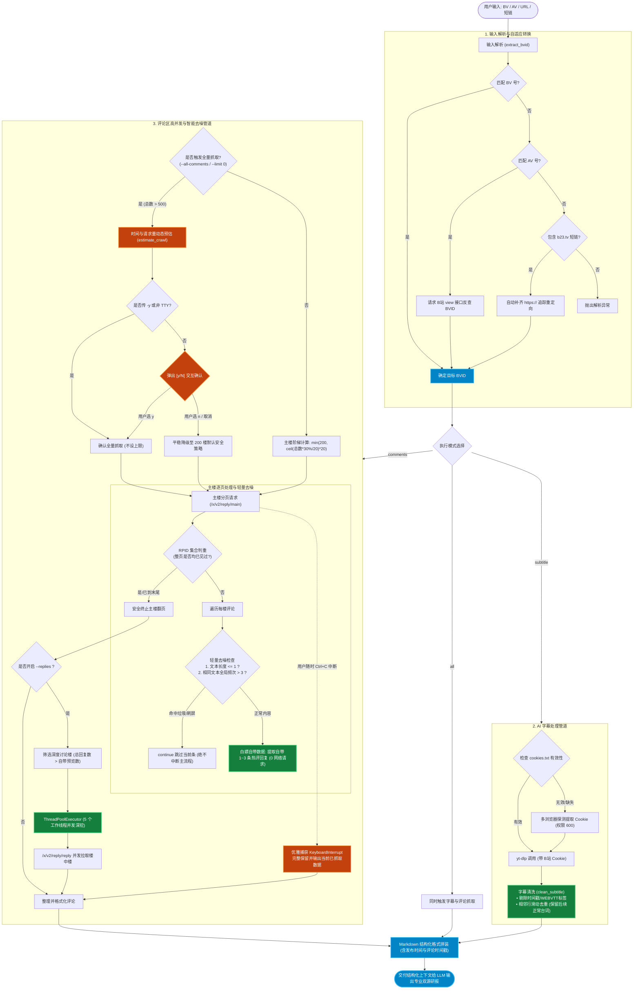

# bili-review 📺

> **高信息密度视频总结神器**：视频官方 AI 字幕（UP 主单方主张） + 深度楼中楼评论（群众实测检验证据）双源情报研报生成器。
>
> 如果这个项目对你有用，欢迎 [⭐ Star](https://github.com/frozentearz/bili-review) 支持，遇到问题或建议请 [📝 提 Issue](https://github.com/frozentearz/bili-review/issues)。

---

## 🎯 分级总结原则（投喂指南）

本工具专为**高密度信息提取与双源交叉验证**设计，请根据内容属性理性分级使用：

| 推荐级别 | 视频类型 | 典型场景 | 为什么值得总结（高 ROI） |
|---|---|---|---|
| ✅ **强烈建议总结** | **技术教程 / 工作流** | 编程开发、环境配置、效率软件、生产力工具 | 快速提取步骤清单，跳过冗余口水话与慢速操作演示 |
| ✅ **强烈建议总结** | **AI 测评 / 软硬件避坑** | 模型评测、数码产品、数码装机、踩坑实录 | 视频吹捧 vs 评论区实测翻车对比，一眼看穿真实优缺点与隐藏成本 |
| ✅ **强烈建议总结** | **干货资讯 / 商业分析** | 行业变局、商业模式拆解、财报解析、政策解读 | 5 秒扫读核心论点与底层逻辑，提炼本质洞察（So What） |
| ✅ **强烈建议总结** | **游戏机制 / 深度攻略** | 数值机制、配装流派、通关路线、改动分析 | 快速获取结论与参数表格，省去长时间跑图视频观看 |
| ⚠️ **不建议总结** | **纯娱乐 / 搞笑日常** | VLOG、搞笑整蛊、生活日常、下饭视频 | 核心价值在于音画情绪与镜头节奏，文字化毫无灵魂且 ROI 极低 |
| ⚠️ **不建议总结** | **影视剪辑 / 音乐舞蹈** | 电影解说、混剪 MV、舞蹈翻跳、纯音乐欣赏 | 视听艺术无法被纯文本替代，总结无实际信息增益 |
| ⚠️ **不建议总结** | **纯情绪输出 / 对线吵架** | 情绪宣泄、无端对线、标题党引战 | 信息信度极低，充满主观偏见与无效噪音 |

---

## ✨ 核心特性

- **双源交叉情报研报**：视频 AI 字幕 + 热门评论/楼中楼多线程并发深挖，杜绝单方信息偏差。
- **自适应模型路由**：内置正反合（测评避坑）、5W2H+MEAT（教程实操）、SCQA（行业洞察）、演绎推理（原理解析）四大分析模型。
- **四大维度 10 项铁律**：从信度（正确性/时效性/客观性）、构度（完整性/聚焦性）、达度（可读性/简洁性/逻辑性）到效度（洞察性/可执行性）严格约束。
- **无感登录态管理**：首创多浏览器自动探测提取 Cookie，一次授权享有约 **150 天免维护期**。
- **免费零依赖**：无需购买任何第三方平台 API Key，仅需 `yt-dlp` + Python 3 标准库。
- **安全与权限保护**：仅提取 B 站相关域名 Cookie，本地文件保存为 `600` 安全权限，默认绝不外泄。

---

## 📦 安装与配置

### 1. 依赖准备

系统需安装 `yt-dlp` 与 `python3`：
```bash
# macOS (推荐 Homebrew)
brew install yt-dlp

# Windows / Linux / macOS (pip 方式)
pip install yt-dlp
```

### 2. 获取技能包

```bash
# 方式一：OpenClaw / ClawHub
openclaw skills install @frozentearz/bili-review

# 方式二：npx skills（任意 Agent）
npx skills add frozentearz/bili-review -g

# 方式三：Git 手动克隆
git clone https://github.com/frozentearz/bili-review.git
```

---

## 🚀 快速上手

```bash
# 1. 首次：从浏览器提取登录态（系统弹窗授权一次，之后 150 天全自动复用）
python3 scripts/bili_review.py login

# 2. 一键抓取双源数据（AI 字幕 + 评论区楼中楼）
python3 scripts/bili_review.py all "BV1YRhM64Eni"

# 3. 仅抓取字幕（支持 --lang ai-zh / ai-en）
python3 scripts/bili_review.py subtitle "https://www.bilibili.com/video/BV1YRhM64Eni"

# 4. 仅抓取评论区（--replies 开启楼中楼深挖）
python3 scripts/bili_review.py comments "BV1YRhM64Eni" --replies --limit 50
```

> 💡 输入格式通用支持：`BV号`、`AV号`（如 `av170001`）、`bilibili.com` 网页完整链接及 `b23.tv` 短链接。

---

## ⚙️ 评论区爬取规则

- **阶梯主楼规则**：`楼层 = min(200, ceil(评论数 × 30% ÷ 20) × 20)` —— 单调不降、按 20 条/页对齐、自动封顶 200 楼（10 页）。
- **智能楼中楼规则**：
  - 默认提取主接口自带的 1~3 条热评回复（0 额外网络开销）。
  - 开启 `--replies` 时，使用 5 线程并发池深挖：
    - 单楼回复 ≤20 条：全量爬取
    - 单楼回复 21~250 条：抓取 40 条
    - 单楼回复 250+ 条：抓取 60 条
- **全量扫描与二次确认**：
  - 支持 `--all-comments` 或 `--limit 0` 开启全量抓取。
  - 评论量 >500 条时自动进行请求量与耗时预估，并弹出 `[y/N]` 确认（脚本环境可用 `-y` 自动确认）。
- **去噪与防死循环**：过滤单字/纯符号水评；同一文本全局出现 >3 次自动忽略；基于 RPID 集合判定防死循环；支持随时 `Ctrl+C` 优雅中断并输出已抓取数据。

---

## 🔒 登录态与安全机制

- **多浏览器自动探测**：顺序探测 Chrome → Edge → Firefox → Brave → Chromium → Opera → Vivaldi → Whale → Safari，自动选取有效登录态。
- **安全沙箱隔离**：`cookies.txt` **仅筛选提取 B 站相关域名**（`bilibili.com` / `b23.tv` / `biligame.com`），绝不触碰任何其他网站数据。
- **权限与版本保护**：文件权限设置为 `600`（仅当前系统用户可读写）；已在 `.gitignore` 与 `.clawhubignore` 中严格排除，绝不提交至代码仓库或分发包。

---

## 🗺️ 架构与数据管道

> 💡 **在线交互版流程图**：可访问 [🔗 GitHub Pages 高清交互图](https://frozentearz.github.io/bili-review/flowchart.html)（支持鼠标滚轮无级缩放与拖拽）。



---

## 🛣️ 路线图（Roadmap）

- [x] **v1.0**：实现基础 AI 字幕抓取与热门评论爬取。
- [x] **v1.2**：多浏览器 Cookie 提取、楼中楼并发深挖与 150 天免维护机制。
- [x] **v2.0**：
  - 视频发布时间与评论/楼中楼时间戳全链路支持。
  - 工业级 Agent 研报规范重构（四大维度 10 项准则 + 4 大自适应模型路由）。
  - Mermaid 容灾契约（正文 100% 独立自洽）与 Markdown 规范排版。
- [ ] **v2.1（规划中）**：
  - **油猴插件（Tampermonkey Userscript）**：在 B 站视频播放页面注入「⚡ 双源总结」按钮。
  - **本地轻量 HTTP 守护服务（Local Daemon）**：一键唤起本地 Python 守护进程，秒级生成研报并在网页浮窗完成优雅渲染。

---

## 📄 License

MIT-0（ClawHub 发布规范）

