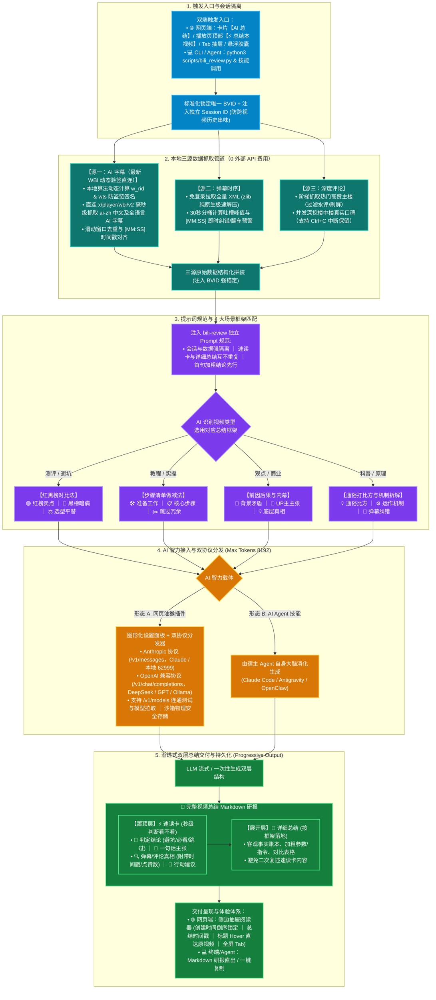

# bili-review 📺

> **高信息密度 B 站视频总结工具**：整合 **官方 AI 字幕**（UP 主主张） + **高能弹幕时序**（即时纠错与群体反应） + **深度楼中楼评论**（群众实测检验），生成三源交叉事实总结。

[](https://github.com/frozentearz/bili-review)
[](LICENSE)

---

## 📺 输出效果预览

`bili-review` 采用**渐进式双层呈现**：顶部置顶【速读卡】快速做决策，下方展开【详细总结】按视频类型提供落地干货。

```markdown
# 《XXX 深度实测》视频总结

> 👤 **UP主**：某科技测评 ｜ 📅 **发布时间**：2026-08-20 ｜ 🔗 **视频地址**：https://www.bilibili.com/video/BV1xxxxxx

---

### ⚡ 速读卡
- 🚦 **判定结论**：【⚠️ 避坑】（核心卖点存在发热暗病，暂不推荐冲首发）
- 📌 **一句话主张**：UP 主宣称性能提升 40%、续航翻倍，是今年最值得买的设备。
- 🔍 **弹幕/评论真相**：弹幕 `[08:24]` 密集吐槽高负载降频；评论区高赞（1200+赞）实测连续运行 20 分钟即触发严重发热卡顿。
- 🎯 **行动建议**：直接跳过首发，建议观望次代固件或选择民间平替。

---

## 📌 详细总（红黑榜版，另有步骤清单、前因后果与内幕、通俗打比方与机制拆解等《总结框架》）结

### 1. 🟢 UP 主吹的卖点（红榜）
- **性能飞跃**：宣称搭载全新架构，基准跑分提升 **40%**。
- **外观轻薄**：厚度缩减至 **8.2mm**，支持磁吸生态。

### 2. 🔴 弹幕与评论扒出的槽点（黑榜）
- **高负载发热降频**：弹幕 `[08:24]` 与 `[11:05]` 集中指出视频剪掉了烤机后半段；评论区多位首发用户反馈 4K 录像 15 分钟必死机。
- **拓展配件溢价高**：官方拓展坞售价高达 **¥599**，且协议私有。

### 3. ⚖️ 选型建议与民间平替
- **适合人群**：仅适合轻度办公、不玩大型游戏的外观党。
- **民间平替**：评论区高赞推荐 **品牌 B 去年同价位旗舰**，性能释放更稳定且便宜 30%。
```

---

## 🚀 选择使用方式

根据你的日常习惯，选择以下任意一种方式即可开箱即用：

### 方式 A：B 站网页端油猴脚本（最简单、适合日常刷视频）

直接在浏览器油猴插件（Tampermonkey / ScriptCat）中导入本仓库根目录下的 [`bili-review.user.js`](bili-review.user.js)：

1. 打开任意 B 站视频播放页面；
2. 页面右侧会出现悬浮工具栏，或直接按下快捷键 <kbd>Tab</kbd> 呼出抽屉面板；
3. 点击 **「一键总结」**，实时流式生成并渲染排版精美的视频总结。

---

### 方式 B：AI Agent 技能包（适合 Claude Code / OpenClaw / Antigravity）

如果你在使用各类 AI 终端或 Agent 工作流，可直接安装技能包：

```bash
# 方式一：OpenClaw / ClawHub
openclaw skills install @frozentearz/bili-review

# 方式二：npx skills（任意 Agent）
npx skills add frozentearz/bili-review -g
```

---

### 方式 C：Python CLI 命令行（适合开发者 / 脚本批量处理）

#### 1. 安装依赖

```bash
# macOS
brew install yt-dlp python3

# Windows / Linux / macOS (pip 方式)
pip install yt-dlp
```

#### 2. 克隆仓库与登录

```bash
git clone https://github.com/frozentearz/bili-review.git
cd bili-review

# 首次运行：从本机浏览器自动提取 Cookie（免输密码，一次授权有效约 150 天）
python3 scripts/bili_review.py login
```

#### 3. 常用抓取命令速查

```bash
# 一键抓取全部三源数据（AI 字幕 + 弹幕时序分析 + 评论区楼中楼）
python3 scripts/bili_review.py all "BV1YRhM64Eni"

# 仅抓取弹幕时序热点（30秒时间轴分桶 + 高能峰值 + 即时纠错预警）
python3 scripts/bili_review.py danmaku "BV1YRhM64Eni"

# 仅抓取字幕（支持 BV号 / AV号 / 网页完整链接 / b23.tv 短链）
python3 scripts/bili_review.py subtitle "https://www.bilibili.com/video/BV1YRhM64Eni"

# 仅抓取评论区（--replies 开启楼中楼深度深挖；--limit 设置楼层数）
python3 scripts/bili_review.py comments "BV1YRhM64Eni" --replies --limit 50
```

---

## 💡 四大场景总结框架

`bili-review` 会根据视频类型自动选用确定性的分析骨架，确保输出直击要害：

| 视频类型               | 适用总结方法             | 交付核心内容                                                                       |
| ---------------------- | ------------------------ | ---------------------------------------------------------------------------------- |
| **测评 / 避坑 / 选型** | **红黑榜对比法**         | 🟢 **红榜**（宣传亮点） ｜ 🔴 **黑榜**（实测槽点/暗病） ｜ ⚖️ **选型建议与民间平替** |
| **教程 / 实操 / 配置** | **步骤清单（做减法）**   | 🛠️ **准备工作** ｜ 📋 **核心步骤（直接抄作业）** ｜ ✂️ **做减法与避坑（跳过冗余）**  |
| **观点 / 商业 / 热点** | **前因后果与内幕**       | 📖 **背景与矛盾** ｜ 🧠 **UP 主主张** ｜ 🔍 **评论区内幕爆料** ｜ 💡 **底层真相**  |
| **科普 / 原理 /架构**  | **通俗打比方与机制拆解** | 💡 **通俗大白话比方** ｜ ⚙️ **底层运作机制** ｜ 📌 **弹幕纠错与细节补充**           |

---

## 🗺️ 全流程架构与数据管道



---

---

## 🔒 隐私与安全机制

- **安全沙箱隔离**：`cookies.txt` **仅筛选提取 B 站相关域名**，绝不读取或触碰其他网站数据。
- **本地权限保护**：本地 Cookie 保存为系统权限 `600`（仅当前系统用户可读写），已严格配置 `.gitignore`，绝不外泄。

---

## 🛣️ 路线图（Roadmap）

- [x] **v1.0**：基础 AI 字幕抓取与热门评论爬取。
- [x] **v1.2**：多浏览器 Cookie 自动提取、楼中楼并发深挖与 150 天免维护机制。
- [x] **v2.0**：视频与评论时间戳支持、结构化 Markdown 规范排版。
- [x] **v2.1**：
  - **弹幕时序分析引擎**：免登录 XML 抓取、30 秒时间轴分桶计算、即时纠错提炼。
  - **双层渐进总结体系**：置顶【速读卡】+ 展开【4 大场景详细总结】。
  - **B 站网页端油猴插件**（`bili-review.user.js`）：Tab 键呼出侧边栏抽屉与一键总结。

---

## 📄 License

MIT-0 License
